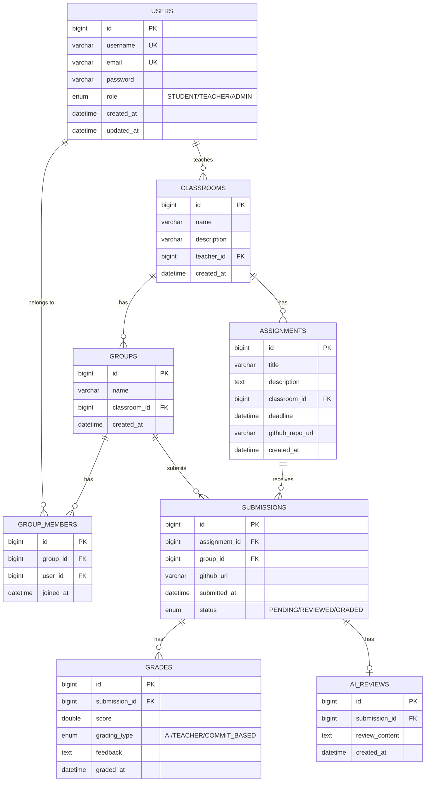

# EGAS - Database Schema

## ERD (Entity Relationship Diagram)



## SQL Tạo bảng (tham khảo - JPA sẽ tự tạo)

```sql
CREATE DATABASE IF NOT EXISTS egas_db;
USE egas_db;

CREATE TABLE users (
    id BIGINT AUTO_INCREMENT PRIMARY KEY,
    username VARCHAR(50) NOT NULL UNIQUE,
    email VARCHAR(100) NOT NULL UNIQUE,
    password VARCHAR(255) NOT NULL,
    role ENUM('STUDENT', 'TEACHER', 'ADMIN') NOT NULL DEFAULT 'STUDENT',
    created_at DATETIME DEFAULT CURRENT_TIMESTAMP,
    updated_at DATETIME DEFAULT CURRENT_TIMESTAMP ON UPDATE CURRENT_TIMESTAMP
);

CREATE TABLE classrooms (
    id BIGINT AUTO_INCREMENT PRIMARY KEY,
    name VARCHAR(100) NOT NULL,
    description VARCHAR(500),
    teacher_id BIGINT NOT NULL,
    created_at DATETIME DEFAULT CURRENT_TIMESTAMP,
    FOREIGN KEY (teacher_id) REFERENCES users(id)
);

CREATE TABLE groups_tbl (
    id BIGINT AUTO_INCREMENT PRIMARY KEY,
    name VARCHAR(100) NOT NULL,
    classroom_id BIGINT NOT NULL,
    created_at DATETIME DEFAULT CURRENT_TIMESTAMP,
    FOREIGN KEY (classroom_id) REFERENCES classrooms(id)
);

CREATE TABLE group_members (
    id BIGINT AUTO_INCREMENT PRIMARY KEY,
    group_id BIGINT NOT NULL,
    user_id BIGINT NOT NULL,
    joined_at DATETIME DEFAULT CURRENT_TIMESTAMP,
    FOREIGN KEY (group_id) REFERENCES groups_tbl(id),
    FOREIGN KEY (user_id) REFERENCES users(id),
    UNIQUE KEY uk_group_user (group_id, user_id)
);

CREATE TABLE assignments (
    id BIGINT AUTO_INCREMENT PRIMARY KEY,
    title VARCHAR(200) NOT NULL,
    description TEXT,
    classroom_id BIGINT NOT NULL,
    deadline DATETIME,
    github_repo_url VARCHAR(500),
    created_at DATETIME DEFAULT CURRENT_TIMESTAMP,
    FOREIGN KEY (classroom_id) REFERENCES classrooms(id)
);

CREATE TABLE submissions (
    id BIGINT AUTO_INCREMENT PRIMARY KEY,
    assignment_id BIGINT NOT NULL,
    group_id BIGINT NOT NULL,
    github_url VARCHAR(500),
    submitted_at DATETIME DEFAULT CURRENT_TIMESTAMP,
    status ENUM('PENDING', 'REVIEWED', 'GRADED') DEFAULT 'PENDING',
    FOREIGN KEY (assignment_id) REFERENCES assignments(id),
    FOREIGN KEY (group_id) REFERENCES groups_tbl(id)
);

CREATE TABLE grades (
    id BIGINT AUTO_INCREMENT PRIMARY KEY,
    submission_id BIGINT NOT NULL,
    score DOUBLE,
    grading_type ENUM('AI', 'TEACHER', 'COMMIT_BASED'),
    feedback TEXT,
    graded_at DATETIME DEFAULT CURRENT_TIMESTAMP,
    FOREIGN KEY (submission_id) REFERENCES submissions(id)
);

CREATE TABLE ai_reviews (
    id BIGINT AUTO_INCREMENT PRIMARY KEY,
    submission_id BIGINT NOT NULL,
    review_content TEXT,
    created_at DATETIME DEFAULT CURRENT_TIMESTAMP,
    FOREIGN KEY (submission_id) REFERENCES submissions(id)
);
```

> 💡 **Lưu ý:** Khi dùng JPA với `ddl-auto: update`, Hibernate sẽ tự tạo bảng từ Entity classes.
> File SQL này chỉ để tham khảo cấu trúc.
